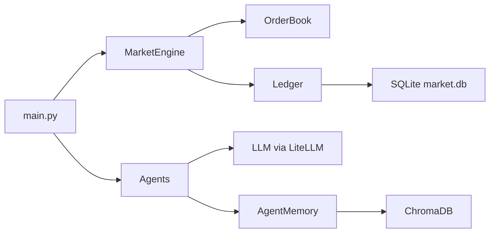

# Agent Market Simulation

A multi-agent marketplace simulation where autonomous agents trade, negotiate, and adapt using LLM-driven strategies. Built for the Multi-Agent Marketplace Simulation Challenge to demonstrate autonomous agent behavior, observability, and reproducibility.

## Purpose

Simulate a functioning marketplace with multiple autonomous agents, then provide clear evidence of behavior (logs, reports, checkpoints) so evaluators can understand outcomes and system dynamics.

## Overview

- 12 agents with distinct personas and trading strategies
- Hybrid LLM strategy (model selection by persona)
- Persistent memory (ChromaDB) + transaction/interaction ledgers (SQLite)
- Live terminal UI + post-run reports

## Architecture



Core loop:
1) Sense: agents receive MarketState
2) Think: retrieve memories + query LLM
3) Act: return structured decision
4) Execute: match orders, update portfolios, persist logs

## Quick Start

### Prerequisites
- Python 3.12+
- `uv` (recommended) or `pip`

### Install
```bash
git clone https://github.com/your-username/agent-market.git
cd agent-market
uv sync
# OR
pip install -r requirements.txt
```

### API Keys
Copy `.env.example` to `.env` and add keys:
- `GROQ_API_KEY`
- `GEMINI_API_KEY`
- `OPENAI_API_KEY` (optional; not used by default)
 - `OPENROUTER_API_KEY` and `OPENROUTER_MODEL_*` if using OpenRouter

### Run
```bash
uv run python main.py
```

## Demo Guide

Run a bounded simulation and generate evidence artifacts:
```bash
uv run python main.py --max-ticks 200 --checkpoint-every 20 --initial-price 100 --seed-inventory 1
```

## Reports and Evidence

Each run generates a report and index:
- Per-run report: `reports/<run_id>/report.md`
- Index: `reports/index.md`

Other artifacts:
- Logs: `logs/`
- Plots: `plots/`
- Checkpoints: `checkpoints/`

## Analysis

Generate post-run charts:
```bash
uv run python src/analysis/chart.py
```

## Configuration

Common CLI flags:
- `--max-ticks`: stop after N ticks
- `--checkpoint-every`: write checkpoints every N ticks
- `--initial-price`: seed price for the first tick
- `--seed-inventory`: initial units assigned to each agent
- `--no-report`: disable report generation

### LLM Providers

This project rotates across providers to spread free-tier limits. Configure keys and model IDs in `.env`:
- OpenRouter: `OPENROUTER_API_KEY` and `OPENROUTER_MODEL_*` (full `openrouter/<model>` IDs)
- Groq: `GROQ_API_KEY`
- Gemini: `GEMINI_API_KEY`

Provider order is controlled by `MODEL_PROVIDER_ORDER` (e.g., `openrouter,groq,gemini`).
OpenAI is intentionally disabled by default; keep `OPENAI_API_KEY` only if you want to re-enable it later.

Default OpenRouter models in `.env.example` are free-tier `:free` variants; you can swap them anytime from https://openrouter.ai/models.

### Environment Variables

Core config in `.env`:
- `MODEL_PROVIDER_ORDER` controls provider rotation order.
- `OPENROUTER_MODEL_STRATEGIC|ANALYTICAL|RULE|FAST` set per-tier models.
- `MARKET_DATABASE_PATH` and `CHROMA_DB_PATH` control persistence locations.

## Tech Stack

- Python 3.12
- LiteLLM (LLM routing)
- OpenRouter (optional routing and free-tier models)
- SQLModel + SQLite (ledger)
- ChromaDB (agent memory)
- Rich (terminal UI)
- pandas + matplotlib (analysis)

## Documentation

- `TECHNICAL_DOCS.md` for architecture and data flow
- `AGENTS.md` for agent workflow rules

## References

- Agent Laboratory: https://agentlaboratory.github.io/
- Generative Agents: https://github.com/joonspk-research/generative_agents

## Development

Run tests:
```bash
uv run pytest tests/ -v
```

## Reproducibility

Docker is available for consistent runs:
```bash
docker build -t agent-market .
docker run --env-file .env agent-market
```
