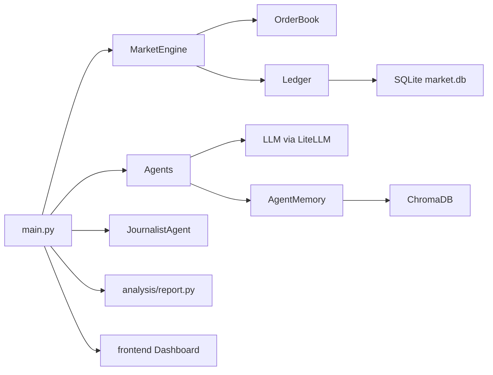

# Agent Market Simulation

This repository implements the Multi-Agent Marketplace Simulation challenge by orchestrating a tick-based crypto/stock hybrid marketplace powered by autonomous LLM agents, persistent memories, and observable evidence artifacts.

## Challenge & Purpose

*Goal*: Create autonomous agents that trade, negotiate, and narrate within a reproducible market while satisfying the [multi-agent marketplace requirements](context/multi-agent-marketplace-simulation.md).

Key deliverables:
1. **10-20 distinct personas** (see `src/utils/personas.py`) racing to buy, sell, or provide liquidity.
2. **Memory system** backed by ChromaDB (`src/memory/memory.py`) so agents retrieve and store rationale.
3. **Complete transaction + interaction ledgers** (`src/market/ledger.py` + `src/analysis/report.py`) for auditability.
4. **Evidence artifacts** (logs, checkpoints, reports, charts, frontend dashboard) to show emergent behavior.
5. Observation of the **Global Guidelines** (`context/global-guidelines.md`): overview, architecture, how to run, and a demo guide reside in this README.

## System Overview

- **Simulation Entry Point (`main.py`)**: Initializes the `MarketEngine`, invests agents with personas/models, and runs the main asyncio tick loop while streaming a Rich dashboard.
- **Market Engine (`src/market/engine.py`)**: Facade pattern that routes actions to the `OrderBook`, negotiates counter-offers, and persists transactions via the `Ledger`.
- **Agents (`src/agents/`)**: `Trader` agents generate decisions through `litellm`, consult `AgentMemory`, and store reasoning; `JournalistAgent` converts market state into human-friendly headlines.
- **Memory (`src/memory/memory.py`)**: Per-agent ChromaDB collection storing short textual memories for retrieval-augmented generation.
- **API & Frontend (`src/api/server.py`, `frontend/`)**: FastAPI exposes REST/WebSocket endpoints while the Next.js dashboard polls `/state`, `/agents`, and streams `/ws`.
- **Analysis (`src/analysis/`)**: Charts & reports transform ledger data into PNG evidence plus Markdown summaries for reviewers.
- **Helpers (`src/utils/`)**: Rate limiting, checkpointing, persona/model routing, and prompt templates centralize shared behavior.


```mermaid
flowchart LR
    A[main.py] --> B[MarketEngine]
    B --> C[OrderBook]
    B --> D[Ledger]
    A --> E[Agents]
    E --> F[LLM via LiteLLM]
    E --> G[AgentMemory]
    G --> H[ChromaDB]
    D --> I[SQLite market.db]
    A --> J[JournalistAgent]
    A --> K[analysis/report.py]
    A --> L[frontend Dashboard]
```

Data Flow:
1. Agents sense `MarketState` from `MarketEngine`.
2. They retrieve memories, build prompts, run LLMs, and emit structured decisions via `litellm`.
3. Engine negotiates, matches via `OrderBook`, updates `Ledger`, and recalculates prices.
4. Transactions & interactions feed `JournalistAgent`, `reports/`, `charts`, and the frontend via the API/WebSocket.

## Quick Start

### Prerequisites

- Python 3.12+
- [`uv`](https://astral.sh/uv) (preferred) or `pip` for dependency management.
- Node.js + npm (for the dashboard)
- Optional: Docker (for reproducible stacks)

### Clone & Install

```bash
git clone https://github.com/your-username/agent-market.git
cd agent-market
uv sync           # installs Python dependencies in a locked virtualenv
cd frontend && npm install
```

### Configuration

1. Copy the example env: `cp .env.example .env`.
2. Fill in API keys (Groq, Gemini, OpenRouter, and configure Vertex AI via `VERTEXAI_PROJECT`/credentials if you want Google Cloud-native inference). The project uses provider rotation in `src/utils/personas.py`.
3. Optional overrides:
   - `MODEL_PROVIDER_ORDER`: controls fallback ordering (default: `cerebras,groq,gemini,openrouter,ollama`).
   - `VERTEXAI_PROJECT` (and related Google Cloud credentials) to treat Vertex AI as an inference provider and route Gemini models through Google Cloud.
   - `MARKET_DATABASE_PATH`, `CHROMA_DB_PATH`: persistence targets.

### Running the Simulation (Terminal UI)

```bash
uv run python main.py
```

Control the simulation with CLI flags:
- `--max-ticks`: limit tick count for reproducible runs.
- `--checkpoint-every`: write JSON snapshots to `checkpoints/`.
- `--report-dir`: output location for Markdown/PDF evidence.

### API Server + Dashboard

1. **Start the API** (FastAPI + SimulationRunner):
   ```bash
   uv run uvicorn src.api.server:app --reload --port 8000
   ```
2. **Dashboard** (Next.js):
   ```bash
   cd frontend
   npm run dev
   ```
   Connects to `NEXT_PUBLIC_API_BASE`/`NEXT_PUBLIC_WS_URL` to stream market data.

Use `scripts/run_all.sh` to simultaneously launch both backend (`uvicorn`) and frontend (`npm run dev`) with environment bonding.

## Evidence & Observability

- **Logs**: `logs/` contains Rich & agent traces (`main.py` and `SimulationRunner` logging).
- **Ledger**: `market.db` (SQLite) captures `Transaction` and `InteractionLog` tables; `src/analysis/report.py` can export them to Markdown + PNG.
- **Plots**: `src/analysis/chart.py` generates price & ROI graphs stored in `plots/` or inside report directories.
- **Checkpoints**: Periodic JSON snapshots (`checkpoints/`) capture prices, agents, and recent actions for debugging the control loop.
- **Reports**: Each run (e.g., `reports/<run_id>`) contains `report.md`, PNG charts, and `index.*` summaries.
- **Dashboard**: Real-time WebSocket broadcast (`/ws`) and REST state endpoints expose the latest `tick`, `sentiment`, and `metrics`.

## Testing & Quality

- `uv run pytest tests/ -v`: verifies engine, order book, ledger, ports, models, and journaling logic.
- The codebase uses `sqlmodel`, `pydantic`, and `litellm`, with docstring-backed inference models.
- Automated report generation (`src/analysis/report.py`) ensures every run produces structured Markdown + JSON summaries.

## Docker & Production Deployment

- Development Compose: `docker-compose.yml` mounts the repository for iterative tinkering.
- Production Compose: `docker-compose.prod.yml` spins up backend, Next.js frontend, and Nginx reverse proxy with persistent volumes.
- `Dockerfile`: builds the Python env with `uv sync`, installs dependencies from `uv.lock`, and runs `uv run main.py`.
- Deployment Scripts: `scripts/pre_deploy_check.sh` validates env/keys, `scripts/deploy.sh` builds Docker images, `scripts/setup_ec2.sh`/`setup_gcp*.sh` bootstrap cloud VMs.

## Challenge Compliance Checklist

- ✅ **Distinct Personas**: 12 personas covering conservative, momentum, panic, value, contrarian, FOMO, algorithmic, whales, market makers, and rumor mongers.
- ✅ **Vector Memory**: Each agent stores PNL reflections via `AgentMemory` (ChromaDB) and retrieves them before issuing decisions.
- ✅ **Ledger/Transactions**: `Ledger` persists both trades (`Transaction`) and meta-actions (`InteractionLog`) tagged by `run_id`.
- ✅ **Narrative Layer**: `JournalistAgent` transforms market state + recent transactions into expressive news-style updates consumed by the dashboard.
- ✅ **No N8N**: The entire flow is implemented in Python (no external orchestration tooling).
- ✅ **Experiment Evidence**: `reports/`, `plots/`, `logs/`, `checkpoints/`, and the Next.js dashboard provide demonstrable behavior.

## Directory Layout

- `src/`: Core Python services (agents, market, memory, API, prompts, utilities, analyses).
- `frontend/`: Next.js dashboard (app router, components, Tailwind styling).
- `scripts/`: Deployment, provisioning, and dev helpers (`deploy.sh`, `run_all.sh`, cloud setup scripts).
- `reports/`, `plots/`, `logs/`, `checkpoints/`: Evidence artifacts created at runtime.
- `context/`: Challenge-specific requirements & evaluation guidelines (`global-guidelines.md`, `multi-agent-marketplace-simulation.md`).
- `TECHNICAL_DOCS.md`: Expanded architecture, CI/CD, persistence, and scaling notes.
- `AGENTS.md`: Workflow & documentation rules for this repo.

## References & Context

- Challenge requirements: [`context/multi-agent-marketplace-simulation.md`](context/multi-agent-marketplace-simulation.md).
- Evaluation guidelines: [`context/global-guidelines.md`](context/global-guidelines.md).
- Extended architecture: [`TECHNICAL_DOCS.md`](TECHNICAL_DOCS.md).
- Agent rules: [`AGENTS.md`](AGENTS.md).

## Tech Stack

- Python 3.12, `uv`, `litellm`, `sqlmodel`, `rich`, `asyncio`.
- ChromaDB vector store for agent memory.
- FastAPI + WebSockets + Next.js 16 dashboard for observability.
- Docker Compose + Nginx for reproducible deployment.
