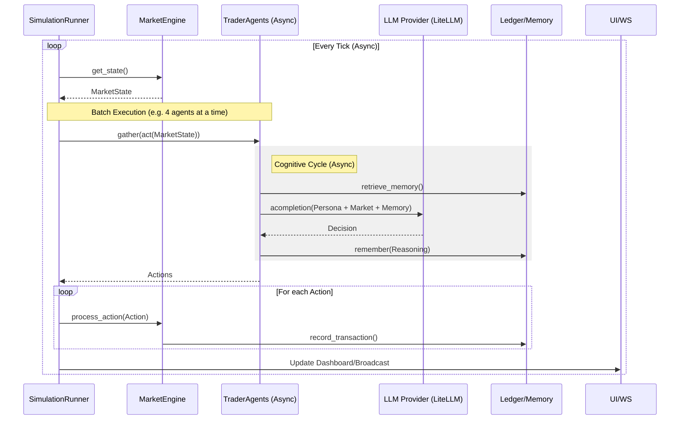

# 🛠 Technical Documentation

## Hybrid LLM Strategy

To maximize performance within rate limits and budget, we employ a tiered model strategy:

| Agent Archetype | Model | Reasoning |
| :--- | :--- | :--- |
| **Whales / Market Makers** | OpenRouter/Groq/Gemini (strategic tier) | High reasoning tier; routed across providers to reduce free-tier limits. |
| **Value Investors** | OpenRouter/Groq/Gemini (analytical tier) | Long-context/analysis tier; routed across providers. |
| **Algorithmic Traders** | OpenRouter/Groq/Gemini (rule tier) | Rule-following tier; routed across providers. |
| **Retail / FOMO** | OpenRouter/Groq/Gemini (fast tier) | Fast, low-cost tier for reactive agents. |

*Implemented in `src/utils/personas.py:get_model_for_persona()` with provider rotation controlled by `MODEL_PROVIDER_ORDER`.*

## System Architecture

The system is a **discrete-time tick-based asynchronous simulation** where autonomous AI agents trade assets in a centralized market.

### Core Components

1.  **Market Engine (`src/market/`)**: Handles order matching, transaction recording, and price discovery.
2.  **Simulation Runner (`src/simulation/runner.py`)**: Asynchronous orchestrator that manages the tick loop and agent concurrency.
3.  **API Server (`src/api/server.py`)**: FastAPI wrapper providing REST and WebSocket access to the live simulation.
4.  **Agents (`src/agents/`)**: Autonomous entities that perceive the market and make decisions using LLMs.
5.  **Memory (`src/memory/`)**: RAG-style memory for each agent using ChromaDB.

### Execution Flow (Async Game Loop)

The simulation uses `asyncio` to handle IO-bound LLM calls concurrently, maximizing tick efficiency without blocking.



### Async Orchestration

-   **Concurrency:** Agents are processed in batches using `asyncio.gather`. This prevents the "serial bottleneck" where one slow LLM call pauses the entire market.
-   **Event Loop:** Both the API server and the simulation run on the same event loop, eliminating the need for complex threading locks.


### Market Engine (`src/market/engine.py`)

Acts as a **Facade** over the `OrderBook` and `Ledger`.
-   **Order Book (`src/market/order_book.py`)**: Double auction with bids as a max-heap and asks as a min-heap.
-   **Ledger (`src/market/ledger.py`)**: SQLModel persistence to `market.db`.
-   **Negotiation (`src/market/engine.py`)**: Generates counter-offer prices using current best quotes.

### Provider Routing (`src/utils/personas.py`)

Model selection is tiered by persona and rotated across OpenRouter/Groq/Gemini providers based on `MODEL_PROVIDER_ORDER`. OpenAI is disabled by default unless explicitly re-enabled.

### Intelligent Agents (`src/agents/trader.py`)

-   **Inputs**: `MarketState` and `Portfolio`.
-   **Brain**: Hybrid LLM strategy per persona.
-   **Output**: Structured JSON enforcing the `TraderDecision` schema.

### Memory System (`src/memory/memory.py`)

-   **Technology**: ChromaDB local vector store.
-   **Write**: Store brief reasoning after each decision.
-   **Read**: Retrieve similar historical context to influence future decisions.

## Data Persistence

### 1. Vector Memory (ChromaDB)
Located in `src/memory/memory.py`.
-   **What is stored:** Natural language summaries of past trading decisions ("I sold at $10 because I felt bearish").
-   **Retrieval:** Before every action, agents query "relevant past mistakes/wins" to avoid repeating errors.

### 2. Transaction Ledger (SQLite/SQLModel)
Located in `src/market/ledger.py`.
-   **Schema:** `Transaction` table (id, timestamp, buyer_id, seller_id, price).
-   **Run IDs:** `run_id` tags each record to connect transactions to a single simulation run.
-   **Purpose:** The source of truth for the `JournalistAgent` and `chart.py` analysis.

### 3. Interaction Ledger (SQLite/SQLModel)
Located in `src/market/ledger.py` and `src/market/schema.py`.
-   **Schema:** `InteractionLog` table (id, timestamp, agent_id, kind, action, item, price, details).
-   **Run IDs:** `run_id` tags each record for per-run reporting.
-   **Purpose:** Persistent audit trail for agent actions and negotiation events.

## Checkpoints

The simulator can emit JSON checkpoints (market state, agent metrics, recent transactions/interactions)
to support reproducibility and experiment evidence.

## Reports

Post-run reports are generated in `reports/<run_id>/report.md`, with a summary index at `reports/index.md`.

## Project Structure

```
.
├── src/
│   ├── agents/
│   │   ├── base.py       # Abstract Agent Class
│   │   ├── trader.py     # The Main Trading Agent
│   │   └── journalist.py # Narrative Generator
│   ├── market/
│   │   ├── engine.py     # Simulation Controller
│   │   ├── ledger.py     # Database Handler
│   │   └── order_book.py # Matching Engine
│   └── analysis/
│       └── chart.py      # Post-simulation plotting
├── main.py               # Entry Point (UI + Loop)
└── market.db             # Local SQLite DB (Gitignored)
```
