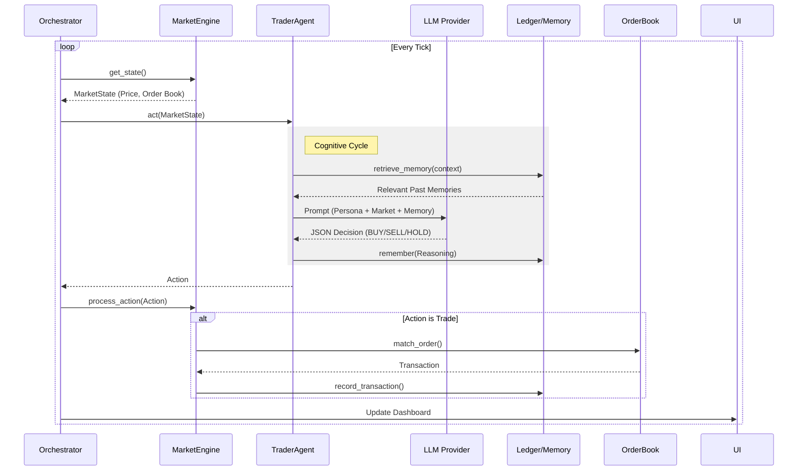

# 🛠 Technical Documentation

## Hybrid LLM Strategy

To maximize performance within rate limits and budget, we employ a tiered model strategy:

| Agent Archetype | Model | Reasoning |
| :--- | :--- | :--- |
| **Whales / Market Makers** | `llama-3.3-70b-versatile` | Requires high reasoning to manipulate markets and manage large capital. |
| **Value Investors** | `gemini-1.5-flash` | Needs large context window to analyze price history and trends effectively. |
| **Algorithmic Traders** | `gpt-4o-mini` | Best at following strict structured output (JSON) rules for high-frequency logic. |
| **Retail / FOMO** | `llama-3.1-8b-instant` | Needs speed and low latency; "vibes based" trading doesn't require deep reasoning. |

*Implemented in `src/utils/personas.py:get_model_for_persona()`*

## System Architecture

The system is a **discrete-time tick-based simulation** where autonomous AI agents trade assets in a centralized market.

### Core Components

1.  **Market Engine (`src/market/`)**: Handles order matching, transaction recording, and time.
2.  **Agents (`src/agents/`)**: Autonomous entities that perceive the market and make decisions using LLMs.
3.  **Memory (`src/memory/`)**: RAG-style memory for each agent.
4.  **Orchestrator (`main.py`)**: Main loop that synchronizes time, UI, and agent turns.

### Execution Flow (Game Loop)



### Market Engine (`src/market/engine.py`)

Acts as a **Facade** over the `OrderBook` and `Ledger`.
-   **Order Book (`src/market/order_book.py`)**: Double auction with bids as a max-heap and asks as a min-heap.
-   **Ledger (`src/market/ledger.py`)**: SQLModel persistence to `market.db`.
-   **Negotiation (`src/market/engine.py`)**: Generates counter-offer prices using current best quotes.

### Intelligent Agents (`src/agents/trader.py`)

-   **Inputs**: `MarketState` and `Portfolio`.
-   **Brain**: Hybrid LLM strategy per persona.
-   **Output**: Structured JSON enforcing the `TraderDecision` schema.

### Memory System (`src/memory/memory.py`)

-   **Technology**: ChromaDB local vector store.
-   **Write**: Store brief reasoning after each decision.
-   **Read**: Retrieve similar historical context to influence future decisions.

## Data Persistence

### 1. Vector Memory (ChromaDB)
Located in `src/memory/memory.py`.
-   **What is stored:** Natural language summaries of past trading decisions ("I sold at $10 because I felt bearish").
-   **Retrieval:** Before every action, agents query "relevant past mistakes/wins" to avoid repeating errors.

### 2. Transaction Ledger (SQLite/SQLModel)
Located in `src/market/ledger.py`.
-   **Schema:** `Transaction` table (id, timestamp, buyer_id, seller_id, price).
-   **Purpose:** The source of truth for the `JournalistAgent` and `chart.py` analysis.

### 3. Interaction Ledger (SQLite/SQLModel)
Located in `src/market/ledger.py` and `src/market/schema.py`.
-   **Schema:** `InteractionLog` table (id, timestamp, agent_id, kind, action, item, price, details).
-   **Purpose:** Persistent audit trail for agent actions and negotiation events.

## Checkpoints

The simulator can emit JSON checkpoints (market state, agent metrics, recent transactions/interactions)
to support reproducibility and experiment evidence.

## Project Structure

```
.
├── src/
│   ├── agents/
│   │   ├── base.py       # Abstract Agent Class
│   │   ├── trader.py     # The Main Trading Agent
│   │   └── journalist.py # Narrative Generator
│   ├── market/
│   │   ├── engine.py     # Simulation Controller
│   │   ├── ledger.py     # Database Handler
│   │   └── order_book.py # Matching Engine
│   └── analysis/
│       └── chart.py      # Post-simulation plotting
├── main.py               # Entry Point (UI + Loop)
└── market.db             # Local SQLite DB (Gitignored)
```
