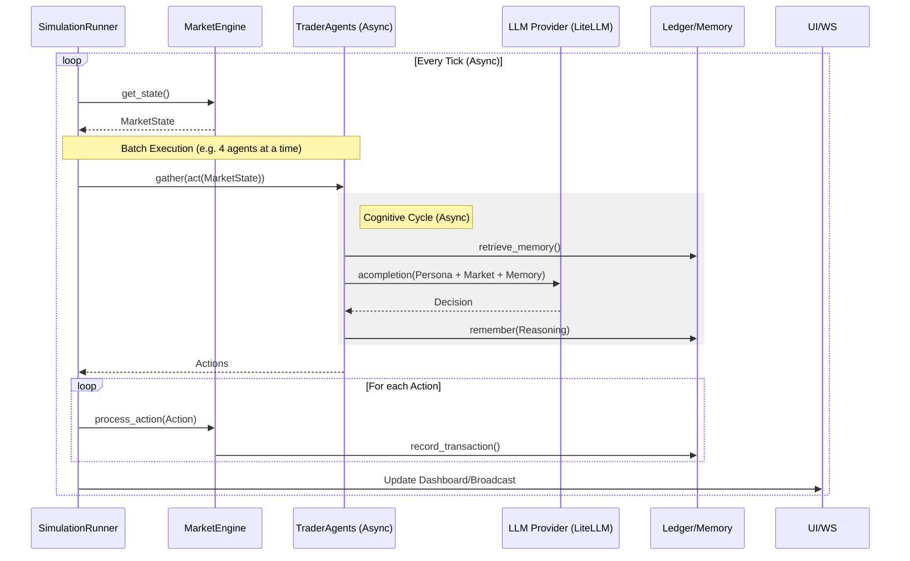

# 🛠 Technical Documentation

## 🔌 API Providers & LLM Strategy

The simulation leverages multiple inference providers to maximize throughput and bypass individual rate limits. We use **LiteLLM** for universal routing and fallbacks.

### Primary Providers
- **Google Gemini**: Used for high-intelligence analytical tasks (e.g., Journalist Agent) and long-context processing.
- **Groq**: Provides low-latency, high-speed inference for reactive "Fast" trader personas.
- **Cerebras**: Integrated for ultra-high-throughput inference with Llama 3.1 models.
- **SambaNova**: Utilized for record-breaking inference speeds and specialized high-performance workloads.
- **OpenRouter**: Acts as a generalized fallback and aggregator for various open-source models (Mistral, etc.).
- **Vertex AI**: Supplies Gemini 1.5 Flash/Pro via Google Cloud to diversify latency/reasoning tiers when `VERTEXAI_PROJECT` is configured.

### Hybrid Model Strategy

| Agent Archetype | Model | Reasoning |
| :--- | :--- | :--- |
| **Whales / Market Makers** | Strategic Tier (Llama 70B / Gemini Pro) | High reasoning for complex position sizing. |
| **Analytical / News** | Gemini 1.5 Flash | Best-in-class at synthesizing large market datasets. |
| **Reactive / Retail** | Fast Tier (Llama 8B / Cerebras) | Speed is priority for high-frequency sentiment shifts. |

*Provider rotation is controlled by `MODEL_PROVIDER_ORDER` in `.env`. Default fallback logic is implemented in `src/utils/personas.py`.*

## System Architecture

The system is a **discrete-time tick-based asynchronous simulation** where autonomous AI agents trade assets in a centralized market.

### Core Components

1.  **Market Engine (`src/market/`)**: Handles order matching, transaction recording, and price discovery.
2.  **Simulation Runner (`src/simulation/runner.py`)**: Asynchronous orchestrator that manages the tick loop and agent concurrency.
3.  **API Server (`src/api/server.py`)**: FastAPI wrapper providing REST and WebSocket access to the live simulation.
4.  **Agents (`src/agents/`)**: Autonomous entities that perceive the market and make decisions using LLMs.
5.  **Memory (`src/memory/`)**: RAG-style memory for each agent using ChromaDB.

### Execution Flow (Async Game Loop)

The simulation uses `asyncio` to handle IO-bound LLM calls concurrently, maximizing tick efficiency without blocking.


```mermaid
sequenceDiagram
    participant Main as SimulationRunner
    participant Engine as MarketEngine
    participant Agents as TraderAgents (Async)
    participant LLM as LLM Provider (LiteLLM)
    participant DB as Ledger/Memory

    loop Every Tick (Async)
        Main->>Engine: get_state()
        Engine-->>Main: MarketState
        
        Note over Main, Agents: Batch Execution (e.g. 4 agents at a time)
        Main->>Agents: gather(act(MarketState))
        
        rect rgb(240, 240, 240)
            Note right of Agents: Cognitive Cycle (Async)
            Agents->>DB: retrieve_memory()
            Agents->>LLM: acompletion(Persona + Market + Memory)
            LLM-->>Agents: Decision
            Agents->>DB: remember(Reasoning)
        end
        
        Agents-->>Main: Actions
        
        loop For each Action
            Main->>Engine: process_action(Action)
            Engine->>DB: record_transaction()
        end
        
        Main->>UI/WS: Update Dashboard/Broadcast
    end
```

### API & Dashboard Observability

- **SimulationRunner (`src/simulation/runner.py`)** spins up the `MarketEngine`, `Trader` agents, and `JournalistAgent` as a background task. It exposes `latest_logs`, `latest_news`, and serialized agent metadata used by the API server.
- **FastAPI Server (`src/api/server.py`)** injects a lifespan hook that starts the `SimulationRunner`, then uses a background `broadcast_loop` to push ticker/news payloads over `/ws`. REST endpoints (`/state`, `/agents`) snapshot the latest in-memory metrics for the dashboard or automation.
- **Frontend Dashboard (`frontend/`)**: The dashboard component polls `/state` and `/agents` once and then listens to `/ws` for delta updates. WebSocket tokens are validated via `X-API-Key`/`token` to respect the same credentials as the REST API.
- This setup keeps the simulation, API, and UI on a single event loop in development (via `uv run uvicorn ...`) but scales nicely via Docker + nginx proxies in production.

### Async Orchestration

-   **Concurrency:** Agents are processed in batches using `asyncio.gather`. This prevents the "serial bottleneck" where one slow LLM call pauses the entire market.
-   **Event Loop:** Both the API server and the simulation run on the same event loop, eliminating the need for complex threading locks.


### Market Engine (`src/market/engine.py`)

Acts as a **Facade** over the `OrderBook` and `Ledger`.
-   **Order Book (`src/market/order_book.py`)**: Double auction with bids as a max-heap and asks as a min-heap.
-   **Ledger (`src/market/ledger.py`)**: SQLModel persistence to `market.db`.
-   **Negotiation (`src/market/engine.py`)**: Generates counter-offer prices using current best quotes.

### Provider Routing (`src/utils/personas.py`)

Model selection is tiered by persona and rotated across OpenRouter/Groq/Gemini providers based on `MODEL_PROVIDER_ORDER`. OpenAI is disabled by default unless explicitly re-enabled.

### Intelligent Agents (`src/agents/trader.py`)

-   **Inputs**: `MarketState` and `Portfolio`.
-   **Brain**: Hybrid LLM strategy per persona.
-   **Output**: Structured JSON enforcing the `TraderDecision` schema.

### Memory System (`src/memory/memory.py`)

-   **Technology**: ChromaDB local vector store.
-   **Write**: Store brief reasoning after each decision.
-   **Read**: Retrieve similar historical context to influence future decisions.

## Data Persistence

### 1. Vector Memory (ChromaDB)
Located in `src/memory/memory.py`.
-   **What is stored:** Natural language summaries of past trading decisions ("I sold at $10 because I felt bearish").
-   **Retrieval:** Before every action, agents query "relevant past mistakes/wins" to avoid repeating errors.

### 2. Transaction Ledger (SQLite/SQLModel)
Located in `src/market/ledger.py`.
-   **Schema:** `Transaction` table (id, timestamp, buyer_id, seller_id, price).
-   **Run IDs:** `run_id` tags each record to connect transactions to a single simulation run.
-   **Purpose:** The source of truth for the `JournalistAgent` and `chart.py` analysis.

### 3. Interaction Ledger (SQLite/SQLModel)
Located in `src/market/ledger.py` and `src/market/schema.py`.
-   **Schema:** `InteractionLog` table (id, timestamp, agent_id, kind, action, item, price, details).
-   **Run IDs:** `run_id` tags each record for per-run reporting.
-   **Purpose:** Persistent audit trail for agent actions and negotiation events.
## Production Infrastructure

The application is designed for cloud deployment on AWS EC2 using a containerized orchestration strategy.

### 🏗 Orchestration (Docker Compose)
The production environment uses `docker-compose.prod.yml` to manage three core services:
1.  **Backend:** FastAPI server running the simulation and REST/WS endpoints.
2.  **Frontend:** Next.js application served in standalone mode for optimal performance and minimal image size.
3.  **Nginx:** High-performance reverse proxy that handles SSL termination (optional), request routing, and WebSocket upgrades.

### 🌐 Network Topology
- **Port 80:** Public-facing entry point managed by Nginx.
- **`/`**: Routed to the Next.js frontend.
- **`/api/`**: Proxied to the FastAPI backend.
- **`/ws`**: WebSocket connection for real-time market data streaming.

### 💾 Persistence Strategy
Named Docker volumes are used to ensure data survives container restarts on the EC2 host:
- `market_db`: Persists the SQLite database (`market.db`).
- `chroma_db`: Persists the agent memory vector store.
- `logs_data`: Retains simulation logs for debugging and auditing.

### 🛠 Deployment Automation
- `scripts/setup_ec2.sh`: One-time environment preparation (Docker, Git, Swap configuration).
- `scripts/deploy.sh`: Automated deployment script that pulls the latest code, builds production-ready images, and performs a graceful restart.

## CI/CD Pipeline Architecture

The project employs a professional-grade automated pipeline via GitHub Actions:

### 🛡️ Quality & Security Gates (CI)
- **Fast Linting**: Powered by `Ruff` for simultaneous linting, formatting, and import sorting.
- **Security Scans**: 
  - `Bandit` analyzes the codebase for common Python security pitfalls.
  - `pip-audit` cross-references dependencies against known vulnerability databases (OSV/GitHub).
- **Docker Verification**: Every PR triggers a dry-run build to ensure the `Dockerfile` remains functional and secure.

### 🚀 Delivery Flow (CD)
- **Registry Integration**: On merges to `main`, Docker images are automatically built, tagged (SHA + Latest), and pushed to **GitHub Container Registry (GHCR)**.
- **Rolling Updates**: The pipeline triggers remote deployment on production instances using secure SSH commands, ensuring zero-downtime restarts.

## Checkpoints

The simulator can emit JSON checkpoints (market state, agent metrics, recent transactions/interactions)
to support reproducibility and experiment evidence.

## Reports

Post-run reports are generated in `reports/<run_id>/report.md`, with a summary index at `reports/index.md`.

## Project Structure

```
.
├── src/
│   ├── agents/
│   │   ├── base.py       # Abstract Agent Class
│   │   ├── trader.py     # The Main Trading Agent
│   │   └── journalist.py # Narrative Generator
│   ├── market/
│   │   ├── engine.py     # Simulation Controller
│   │   ├── ledger.py     # Database Handler
│   │   └── order_book.py # Matching Engine
│   └── analysis/
│       └── chart.py      # Post-simulation plotting
├── main.py               # Entry Point (UI + Loop)
└── market.db             # Local SQLite DB (Gitignored)
```
