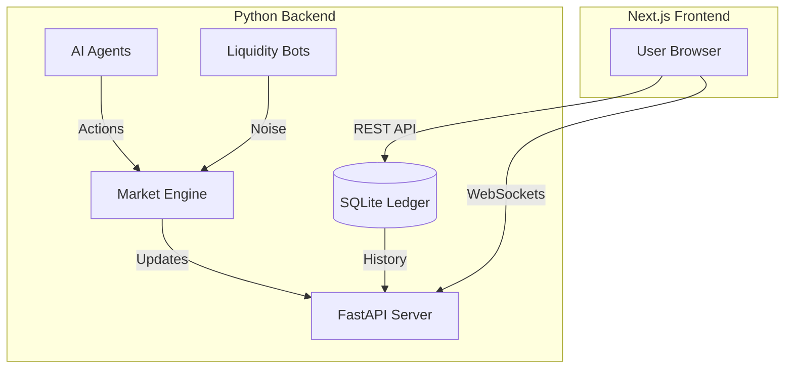

# Project Plan: Agent Market V2 (The "Bitcoin Stock Exchange")

## 1. Scope Definition
**Objective:** Transform the existing single-asset CLI simulation into a multi-asset, crypto-denominated exchange platform where AI agents trade stocks (AAPL, TSLA) against Bitcoin (BTC), visualized via a modern web dashboard.

**In Scope:**
*   Multi-Asset Order Matching Engine (AAPL/BTC, TSLA/BTC).
*   AI Agents capable of trading multiple tickers.
*   Liquidity solution (Automated Market Maker bots).
*   Real-time Web Dashboard (Next.js) replacing the CLI UI.
*   Persistent Ledger (SQLite) for historical analysis.

**Out of Scope:**
*   Real-money integration (Testnet/Mainnet).
*   Distributed deployment (Kubernetes/Redis) - *Deferred to V3*.
*   User-controlled trading (The user is an observer/god-mode only).

---

## 2. Detailed Features

### Core Simulation
*   **Asset Registry:** Support for `AAPL`, `TSLA`, `ETH`, `SOL`.
*   **Base Currency:** All quotes and settlements in `BTC`.
*   **Liquidity Bots:** "Dumb" bots that provide baseline bids/asks.
*   **Agent Scanner:** Agents scan the "Top Movers" before focusing on one chart.

### Web Dashboard (The "Bloomberg Terminal")
*   **Ticker Tape:** Infinite scroll of live prices at the top.
*   **Main Chart:** Interactive candlestick chart (TradingView library).
*   **Order Book Visualizer:** Depth chart showing buy/sell walls.
*   **Agent Feed:** Live log of agent thoughts ("Agent_3 is feeling bullish...").
*   **Control Panel:** Start/Stop/Reset simulation.

---

## 3. Tech Stack

### Backend (The Brains)
*   **Language:** Python 3.12+
*   **API Framework:** **FastAPI** (replaces raw loop for serving data).
*   **Engine:** In-Memory Python Dicts (Order Book) + SQLite (Ledger).
*   **AI:** `litellm` (orchestrating Llama 3 & Gemini).

### Frontend (The Face)
*   **Framework:** **Next.js 14** (App Router).
*   **Styling:** Tailwind CSS (Dark Mode).
*   **Real-time:** WebSockets (`socket.io` or FastAPI native websockets).
*   **Charts:** `lightweight-charts` (TradingView).

---

## 4. Architecture Blueprint

---

## 5. Milestones & Roadmap

### Phase 1: Core Engine Refactor (Current Priority)
*   [ ] Update `schema.py` for BTC & Asset Pairs.
*   [ ] Refactor `MarketEngine` to handle multiple Order Books.
*   [ ] Create `MarketMaker` bot class.

### Phase 2: Agent Intelligence Upgrade
*   [ ] Implement "Scanner" logic (choose asset to trade).
*   [ ] Update `Trader` prompt to understand BTC pricing.
*   [ ] Update `Portfolio` to hold multiple assets.

### Phase 3: The API Layer
*   [ ] Create `server.py` with FastAPI.
*   [ ] Implement WebSocket broadcaster.
*   [ ] Expose endpoints for `GET /history` and `GET /agents`.

### Phase 4: Frontend Development
*   [ ] Initialize Next.js project.
*   [ ] Build "Market Watch" (Ticker Tape).
*   [ ] Build "Price Chart" component.
*   [ ] Connect WebSockets for live data.

---

## 6. Resource Allocation
*   **Developer (You/Me):** Full Stack.
*   **Compute:** Local Machine (initially).
*   **AI Budget:** Monitor usage! 12 Agents x 10 Tickers = $$$ if not careful.

---

## 7. Testing Strategy
*   **Unit Tests:** Verify `OrderBook` matching logic for multiple assets.
*   **Integration Tests:** Verify Agent -> Engine -> API -> WebSocket flow.
*   **"Soak Test":** Run simulation for 1 hour to check for memory leaks or AI hallucinations.

---

## 8. Deployment Plan
*   **Local:** `docker-compose up` (Backend + Frontend containers).
*   **Cloud (V3):** Deploy Backend to Google Cloud Run, Frontend to Vercel.
