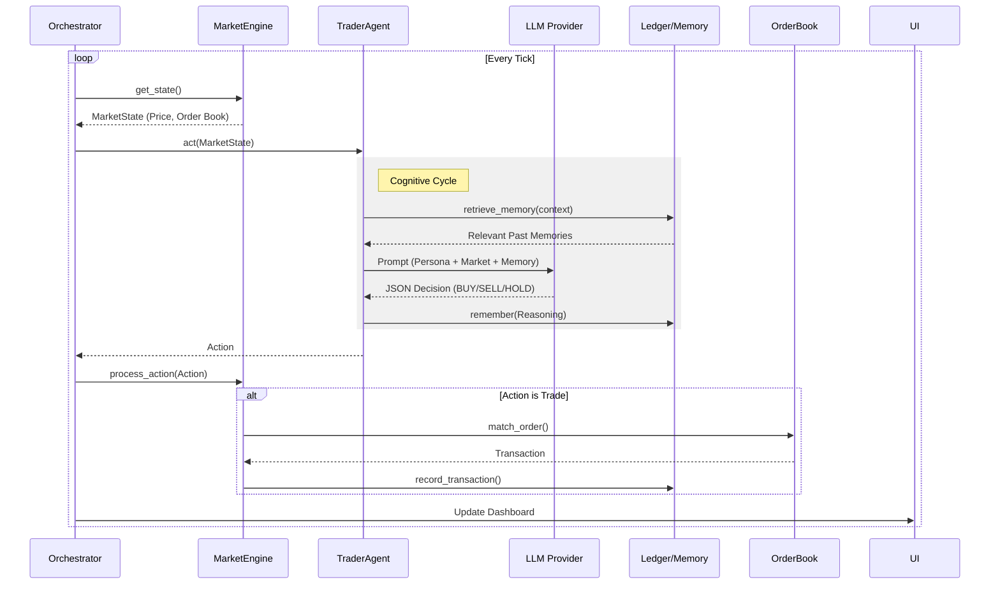

# 🏗 System Architecture

This document provides a detailed technical overview of the **Agent Market Simulation**. It describes the system components, data flow, and key design decisions.

## 1. High-Level Overview

The system is a **discrete-time tick-based simulation** where autonomous AI agents trade assets in a centralized market.

### Core Components

1.  **Market Engine (`src/market/`)**: The "physics" of the world. It handles order matching, transaction recording, and time.
2.  **Agents (`src/agents/`)**: Autonomous entities that perceive the market and make decisions using LLMs.
3.  **Memory (`src/memory/`)**: A RAG (Retrieval-Augmented Generation) system allowing agents to learn from the past.
4.  **Orchestrator (`main.py`)**: The main loop that synchronizes time, UI, and agent turns.

---

## 2. Execution Flow (The Game Loop)

The simulation runs in a `while True` loop in `main.py`.



---

## 3. Component Details

### 3.1 Market Engine (`src/market/engine.py`)
Acts as a **Facade** over the `OrderBook` and `Ledger`.
-   **Order Book (`src/market/order_book.py`)**: Implements a standard Double Auction mechanism.
    -   **Bids**: Max-Heap (Highest price first).
    -   **Asks**: Min-Heap (Lowest price first).
    -   **Matching**: Orders are matched immediately if `Bid >= Ask`. Unmatched orders remain on the book (Limit Orders).
-   **Ledger (`src/market/ledger.py`)**: Uses **SQLModel** (SQLAlchemy) to persist every trade to `market.db`.

### 3.2 Intelligent Agents (`src/agents/trader.py`)
Agents implement the `BaseAgent` interface.
-   **Inputs**: `MarketState` (Price, L1 Order Book data), `Portfolio` (Cash, Holdings).
-   **Brain**: A **Hybrid LLM Strategy**.
    -   *Strategic Agents* use Llama 3 70B (Groq) for complex planning.
    -   *Analytical Agents* use Gemini 1.5 Flash for long-context data analysis.
    -   *Fast Agents* use Llama 3 8B or GPT-4o Mini for speed/cost efficiency.
-   **Output**: Structured JSON enforcing the `TraderDecision` schema.

### 3.3 Memory System (`src/memory/memory.py`)
-   **Technology**: **ChromaDB** (Local Vector Store).
-   **Function**:
    1.  **Write**: After every decision, the agent stores its reasoning: *"I bought at $10 because the trend was up."*
    2.  **Read**: Before the next decision, it queries: *"What happened last time I saw a trend like this?"*
    -   This feedback loop allows agents to potentially "learn" from mistakes or reinforce successful strategies (simulated reinforcement learning via context).

---

## 4. Data Models

### Market State
Snapshot provided to agents:
```python
class MarketState(BaseModel):
    current_price: float
    order_book_summary: Dict[str, Any] # {best_bid, best_ask, counts}
```

### Transaction
Persistent record of a trade:
```python
class Transaction(SQLModel):
    id: int
    buyer_id: str
    seller_id: str
    item: str
    price: float
    timestamp: datetime
```

---

## 5. Deployment Architecture

The system is containerized via **Docker**.
-   `Dockerfile`: Multi-stage build (python-slim).
-   `docker-compose.yml`: Orchestrates the app and potential future services (e.g., remote ChromaDB).

See [DEPLOYMENT.md](../DEPLOYMENT.md) for production details.
